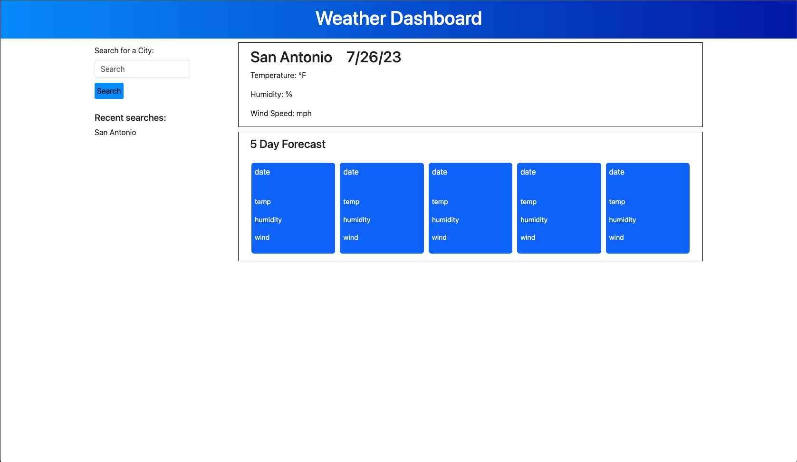

# Whats-the-forecast

## Description

The following assignment required the developer to create a functioning weather dashboard that would fetch information from a weather API. The assignment was completed when the user was able to search for a city and it would display the current weather. If the user decided to search for another city the previous city would be displayed below in the search history. The searched city needed to display the date, a weather icon, temperature, humidity, and wind speed. The developer also needed to display a five day forecast for the city searched. 

## Website Link

[Weather Dashboard](https://solis07.github.io/Whats-the-forecast/)

## Screenshot

